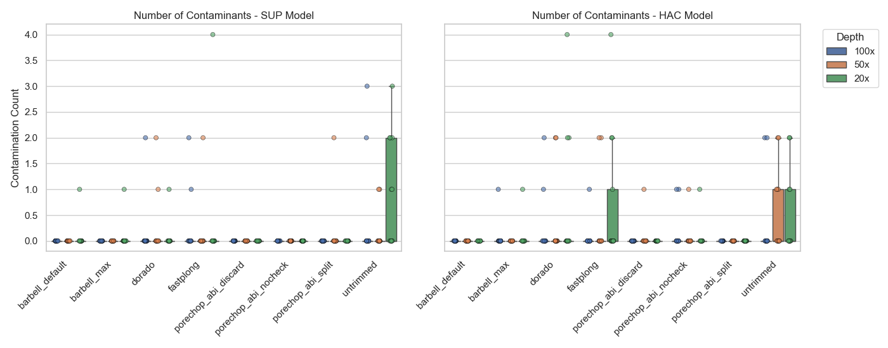

## Tracking sample kits

### From pod5 metadata

| Sample name | Sequencing kit(s) |
|---------------------|---------------------------------------------------|
| ATCC_10708\_\_202309 | SQK-NBD114-96: 13,446,170 reads (94.21%); SQK-RBK114-96: 825,976 reads (5.79%) |
| ATCC_17802\_\_202309 | SQK-NBD114-96: 4,376,835 reads (88.75%); SQK-RBK114-96: 554,861 reads (11.25%) |
| ATCC_19119\_\_202309 | SQK-NBD114-96: 953,667 reads (59.77%); SQK-RBK114-96: 641,925 reads (40.23%) |
| ATCC_25922\_\_202309 | SQK-NBD114-96: 5,798,609 reads (84.43%); SQK-RBK114-96: 1,069,262 reads (15.57%) |
| ATCC_33560\_\_202309 | SQK-NBD114-96: 512,332 reads (51.65%); SQK-RBK114-96: 479,634 reads (48.35%) |
| ATCC_35221\_\_202309 | SQK-NBD114-96: 411,321 reads (56.29%); SQK-RBK114-96: 319,425 reads (43.71%) |
| ATCC_35897\_\_202309 | SQK-NBD114-96: 714,169 reads (41.62%); SQK-RBK114-96: 1,001,157 reads (58.38%) |
| ATCC_BAA-679\_\_202309 | SQK-NBD114-96: 824,339 reads (48.17%); SQK-RBK114-96: 886,871 reads (51.83%) |
| KPC2\_\_202310 | SQK-NBD114-96: 35,284 reads (71.79%); SQK-RBK114-96: 13,862 reads (28.21%) |
| AJ292\_\_202310 | SQK-NBD114-96: 71,694 reads (100%) |
| RDH275\_\_202311 | SQK-NBD114-96: 1,010,169 reads (100%) |
| MMC234\_\_202311 | SQK-NBD114-96: 236,014 reads (100%) |
| BPH2947\_\_202310 | SQK-NBD114-96: 162,292 reads (100%) |
| AMtb_1\_\_202402 | SQK-NBD114-96: 186,332 reads (100%) |

Based on the POD5 runinfo metadata, nine samples contain reads from both the native barcoding kit (SQK-NBD114-96) and the rapid barcoding kit (SQK-RBK114-96). In most of these mixed samples, the native kit contributed a higher proportion of reads. The remaining five samples appear to contain reads only from the native barcoding kit.

can we just use pod5 files that come from native barcode?

## Exploring barcode contaminats detection with minimap2

Initially, I considered using the barcode FASTA as the query and the assembly as the target. However, because I want to allow same barcode sequence to align to multiple possible regions in the assembly, but avoid having one assembly region matched by multiple barcode sequences, I decided to treat the barcode FASTA as the target/reference and the assembly as the query. This is quite similar to the mapping config issue we discussed in the Eris project last semester..

minimap2 command: `minimap2 -c -x sr -k 9 -w 1 -n 1 -m 14 <barcodes.fasta> <assembly.fasta>`

Since minimap2 performs local alignment, I kept the barcode and flanking sequence together as one target sequence. My reasoning is that I still want to retain information from the adjacent flanking regions, while also being able to detect cases where only part of the barcode or flank remains in the assembly. For example, this could include a full barcode with partial flanking sequence, or a full flanking sequence with only part of the barcode.

Instead, I wrote an additional function to break down each alignment by region. This allows me to calculate how much of the left flank, barcode, and right flank are covered by the alignment.

- Rapid barcode: \[Left flank\] - \[Barcode\] - \[Right flank\]
- Native barcode: \[Adapter\] - \[Flank+barcode\]

I think this is more robust than searching each region separately, or treating the entire barcode-flank sequence as one region. The filtering aprroach is also based on coverage of specific regions (90% for instance), so we do not miss cases where one region aligns well but another region does not, possibly because it was correctly trimmed.

I also added information about where a contaminant is located relative to the contig in the assembly. I classified the location into three categories:

- start: within the first 100 bp of the contig.
- end: within the last 100 bp of the contig.
- middle: the contaminant is not located within either the first or last 100 bp of the contig.

### Testing on the barbell assembly

I first tested this approach on the Barbell assembly (from rapid kit):

```{python}
# !python detect_contaminant_minimap2.py --barcode-dir ../barcodes/ --assembly ../test_assemblies/bc49_medaka_consensus.114.fasta -o bc49_medaka_consensus.cont.tsv 2> /dev/null
!csvtk -t pretty ../results/contaminants/bc49_medaka_consensus.cont.tsv
```

The script detected three barcode hits, which is similar to what Barbell reported. I also calculated the coverage for each sub-region, including the left flank, right flank, and actual barcode sequence.

### Testing on KPC2\_\_202310 at 20× depth

I then tested the script on the KPC2\_\_202310 20× (a mixed sample) assembly generated from Dorado processed reads

```{python}
# !python detect_contaminant_minimap2.py -d ../barcodes/ -a ../test_assemblies/KPC2__202310.dorado.20x.assembly.fasta -o KPC2__202310.dorado.20x.cont.tsv 2> /dev/null
!csvtk -t pretty ../results/contaminants/KPC2__202310.dorado.20x.cont.tsv
```

No barcode contamination was detected in this assembly.

#### Testing with manually inserted barcode contaminants

To check whether this aproach can detect known barcode contamination, I manually inserted six barcode sequences into the clean KPC2 assembly above. The aim was to create a positive control assembly and test whether the script could recover all inserted contaminants correctly.

The manually inserted contaminants were:

- Rapid barcode sequences:
  - BC05 inserted at the start of contig_1 (part of the flank deleted, base error in barcode).
  - BC06 inserted at the start of contig_2, (the full barcode-flank structure retained).
- Native right barcode sequences:
  - Native_bottom_3 inserted at the end of contig_1 (part of the adapter deleted).
- Native left barcode sequences
  - Native_top_3 inserted at the start of contig_3. (part of the adapter deleted)
  - Native_top_4 inserted at the start of contig_4 (the full barcode-adapter structure retained).
  - Native_bottom_3 inserted at the end of contig_4, (part of the adapter deleted).

I then ran the detection script again on the manually contaminated assembly:

```{python}
# !python detect_contaminant_minimap2.py -a ../test_assemblies/KPC2__202310.dorado.20x.assembly.cont.fasta -d ../barcodes/ -o KPC2__202310.dorado.20x.cont.insert.tsv 2> /dev/null

!csvtk -t pretty ../results/contaminants/KPC2__202310.dorado.20x.cont.insert.tsv
```

It does find all the six manually inserted contaminants correctly.

One important observation is that the core barcode sequences are often identical, or reverse complements, across the native and rapid kits. The main difference between kits is usually in the flanking adapter sequence. Therefore, when a native barcode is inserted into the assembly, it can naturally produce a partial hit against the rapid barcode reference as well.

This means that, in mixed kit samples, multiple barcode records from different barcode files can align to the same region of the assembly. To resolve these overlapping alignment results, I selected the barcode hit with the higher overall dp_score or alignment score as the most likely match.

The flanking regions and also adapter sequence are important for distinguishing whether the detected sequence is more consistent with the native or rapid kit structure.

### Testing on ATCC_25922\_\_202309 at 20x depth

#### dorado processed reads

```{python}
# !python detect_contaminant_minimap2.py -d ../barcodes/ -a ../test_assemblies/ATCC_25922__202309.dorado.20x.assembly.fasta -o ATCC_25922__202309.dorado.20x.cont.tsv 2> /dev/null

!csvtk -t pretty ../results/contaminants/ATCC_25922__202309.dorado.20x.cont.tsv
```

In this particular sample, `dorado trim` to successfully identify and remove the 36 bp adapter, leaving only around 0–25% of the adapter sequence behind. However, `dorado trim` appears to completely miss the barcode and flanking sequences. The hist are either at the start (first 100bp) or at the ends (last 100bp) of contigs

Here I am also a bit worried if `dorado trim` doesn't trim the barcode, it does only trim the adapter..

Since almost all of the hits have perfect identity, I next checked whether the barcode sequence itself is present in the assembly using `seqkit locate`.

```{python}
!seqkit locate -p "AAGGTTAAGACCATTGTGATGAACCCTGTTGTCAGCACCT" ../test_assemblies/ATCC_25922__202309.dorado.20x.assembly.fasta
```

The result from `seqkit locate` also matched with the minimap2 script, it has Native_top_75 contaminats with 100% identity in seven different positons in the assembly.

#### porecho_abi discard processed reads

```{python}
# !python detect_contaminant_minimap2.py -d ../barcodes/ -a ../test_assemblies/ATCC_25922__202309.porechop_abi_discard.20x.assembly.fasta -o ATCC_25922__202309.porechop_abi_discard.20x.cont.tsv 2> /dev/null

!csvtk -t pretty ../results/contaminants/ATCC_25922__202309.porechop_abi_discard.20x.cont.tsv
```

Similar to the Dorado reads, this sample detected 13 contaminants, but with a different contaminant profile. It also detected barcode sequences from the rapid kit. For example, BC11 showed a consistent regional breakdown of approximately \[Left: 38% \| Barcode: 100% \| Right: 100%\].

Similar to the Dorado result, `porechop_abi_discard` successfully removed the 36 bp adapter from the native reads. However, it appears to completely ignore the barcode and flanking segment, which remains full or almost full in the assembly.

### Testing on the other assemblies

#### Contamination count

```{python}
import pandas as pd
import matplotlib.pyplot as plt
import seaborn as sns

contamination_count = pd.read_csv("../../results/tables/assess/assembly/metrics/contaminant_summary_count.csv")

sns.set_theme(style="whitegrid")
models = ["sup", "hac"]
hue_order = ["100x", "50x", "20x"]
order_abs = sorted(contamination_count["trimmer"].unique())

fig, axes = plt.subplots(nrows=1, ncols=len(models), figsize=(14, 5.5), dpi=100, sharex=True, sharey=True)

for c, model in enumerate(models):
    ax = axes[c]
    # During loop 1, the variable `model` equals "sup"
    contamination_count_sub = contamination_count.query("model == @model")

    if not contamination_count_sub.empty:
        sns.boxplot(data=contamination_count_sub, x="trimmer", y="contamination_count", hue="depth", order=order_abs, hue_order=hue_order, ax=ax, fliersize=0, gap=0.1)

        sns.stripplot(data=contamination_count_sub, x="trimmer", y="contamination_count", hue="depth", order=order_abs, hue_order=hue_order, ax=ax, alpha=0.6, dodge=True, linewidth=0.5, edgecolor="black", legend=False)

    # force standard numbers instead of scientific notation
    ax.yaxis.set_major_formatter(plt.ScalarFormatter())

    # clean up the labels for a polished look
    ax.set_ylabel("Contamination Count" if c == 0 else "")
    ax.set_title(f"Number of Contaminants - {model.upper()} Model")
    ax.set_xlabel("")
    ax.set_xticks(ax.get_xticks())
    ax.set_xticklabels(ax.get_xticklabels(), rotation=45, ha="right", fontsize=11)

    if c == 1 and ax.get_legend() is not None:
        ax.legend(title="Depth", bbox_to_anchor=(1.05, 1), loc='upper left')
    elif ax.get_legend() is not None:
        ax.get_legend().remove()

fig.tight_layout()
plt.savefig("../../results/figures/assess/assembly/metrics/assembly_contamination_minimap2.png")
```



#### Contamination details

##### Contamination region (total)

```{python}
import pandas as pd
import re

contamination_details = pd.read_csv("../../results/tables/assess/assembly-prev/metrics/contaminant_details.csv")

def extract_all_coverages(row):
    """
    Extracts numerical percentages for all regions based on the kit type.
    Returns a pandas Series to create multiple columns at once.
    """
    breakdown = str(row['region_breakdown'])
    kit = str(row['kit'])

    # Initialize variables with NaN (so missing data doesn't default to 0)
    cov_data = {
        'adapter_cov': pd.NA,
        'left_cov': pd.NA,
        'barcode_cov': pd.NA,
        'right_cov': pd.NA
    }

    if kit == 'rapid':
        m_left = re.search(r'Left:\s*(\d+)%', breakdown)
        m_bar = re.search(r'Bar:\s*(\d+)%', breakdown)
        m_right = re.search(r'Right:\s*(\d+)%', breakdown)

        if m_left: cov_data['left_cov'] = int(m_left.group(1))
        if m_bar: cov_data['barcode_cov'] = int(m_bar.group(1))
        if m_right: cov_data['right_cov'] = int(m_right.group(1))

    elif 'native' in kit:
        m_adapter = re.search(r'Adapter:\s*(\d+)%', breakdown)
        m_bar = re.search(r'Bar\+Flank:\s*(\d+)%', breakdown)

        if m_adapter: cov_data['adapter_cov'] = int(m_adapter.group(1))
        if m_bar: cov_data['barcode_cov'] = int(m_bar.group(1))

    return pd.Series(cov_data)

# Apply the function and join the new columns to the dataframe
extracted_cols = contamination_details.apply(extract_all_coverages, axis=1)
contamination_details = pd.concat([contamination_details, extracted_cols], axis=1)

# Flag rows where coverage is 90% or greater (ignoring NAs)
contamination_details['bar_fully_covered'] = contamination_details['barcode_cov'] >= 90
contamination_details['adapter_fully_covered'] = contamination_details['adapter_cov'] >= 90
contamination_details['left_fully_covered'] = contamination_details['left_cov'] >= 90
contamination_details['right_fully_covered'] = contamination_details['right_cov'] >= 90

# Create a summary of how often each region is fully covered
print("=== Full Coverage Summary (>= 90%) ===")

# We group by kit so we don't mix rapid vs native metrics
summary = contamination_details.groupby('kit').agg(
    total_hits=('kit', 'count'),

    # Barcode is shared between both kits
    bar_full_count=('bar_fully_covered', 'sum'),

    # Native specific
    adapter_full_count=('adapter_fully_covered', 'sum'),

    # Rapid specific
    left_full_count=('left_fully_covered', 'sum'),
    right_full_count=('right_fully_covered', 'sum')
)

# Calculate percentages based on the total hits for that kit type
summary['%_Bar_Full'] = (summary['bar_full_count'] / summary['total_hits'] * 100).round(2)
summary['%_Adapter_Full'] = (summary['adapter_full_count'] / summary['total_hits'] * 100).round(2)
summary['%_Left_Full'] = (summary['left_full_count'] / summary['total_hits'] * 100).round(2)
summary['%_Right_Full'] = (summary['right_full_count'] / summary['total_hits'] * 100).round(2)

# Rearrange columns for a cleaner printout
final_summary = summary[[
    'total_hits',
    '%_Bar_Full',
    '%_Adapter_Full',
    '%_Left_Full',
    '%_Right_Full'
]]
final_summary
```

##### Contamination region (per trimmer)

```{python}
import pandas as pd
import re
import os

COVERAGE_THRESHOLD = 90  # Change this value to adjust the strictness

contamination_details = pd.read_csv("../../results/tables/assess/assembly-prev/metrics/contaminant_details.csv")

def extract_all_coverages(row):
    """
    Extracts numerical percentages for all regions based on the kit type.
    """
    breakdown = str(row['region_breakdown'])
    kit = str(row['kit'])

    cov_data = {
        'adapter_cov': pd.NA,
        'left_cov': pd.NA,
        'barcode_cov': pd.NA,
        'right_cov': pd.NA
    }

    if kit == 'rapid':
        m_left = re.search(r'Left:\s*(\d+)%', breakdown)
        m_bar = re.search(r'Bar:\s*(\d+)%', breakdown)
        m_right = re.search(r'Right:\s*(\d+)%', breakdown)

        if m_left: cov_data['left_cov'] = int(m_left.group(1))
        if m_bar: cov_data['barcode_cov'] = int(m_bar.group(1))
        if m_right: cov_data['right_cov'] = int(m_right.group(1))

    elif 'native' in kit:
        m_adapter = re.search(r'Adapter:\s*(\d+)%', breakdown)
        m_bar = re.search(r'Bar\+Flank:\s*(\d+)%', breakdown)

        if m_adapter: cov_data['adapter_cov'] = int(m_adapter.group(1))
        if m_bar: cov_data['barcode_cov'] = int(m_bar.group(1))

    return pd.Series(cov_data)

# Apply the function and join the new columns
extracted_cols = contamination_details.apply(extract_all_coverages, axis=1)
contamination_details = pd.concat([contamination_details, extracted_cols], axis=1)

# Flag rows using the configurable threshold
contamination_details['bar_fully_covered'] = contamination_details['barcode_cov'] >= COVERAGE_THRESHOLD
contamination_details['adapter_fully_covered'] = contamination_details['adapter_cov'] >= COVERAGE_THRESHOLD
contamination_details['left_fully_covered'] = contamination_details['left_cov'] >= COVERAGE_THRESHOLD
contamination_details['right_fully_covered'] = contamination_details['right_cov'] >= COVERAGE_THRESHOLD

# Force all combinations of Trimmer and Kit to appear (even if count is 0)
all_trimmers = contamination_details['trimmer'].unique()
all_kits = ['native_left', 'native_right', 'rapid']

contamination_details['trimmer'] = pd.Categorical(contamination_details['trimmer'], categories=all_trimmers)
contamination_details['kit'] = pd.Categorical(contamination_details['kit'], categories=all_kits)

print(f"Calculating summaries per trimmer (Threshold: >={COVERAGE_THRESHOLD}%)...")

# 'observed=False' is the magic parameter that includes the empty groups
summary = contamination_details.groupby(['trimmer', 'kit'], observed=False).agg(
    total_hits=('kit', 'count'),
    bar_full_count=('bar_fully_covered', 'sum'),
    adapter_full_count=('adapter_fully_covered', 'sum'),
    left_full_count=('left_fully_covered', 'sum'),
    right_full_count=('right_fully_covered', 'sum')
)

# Calculate percentages (using fillna(0) to avoid NaN when total_hits is 0)
summary['%_Bar_Full'] = (summary['bar_full_count'] / summary['total_hits'] * 100).fillna(0).round(2)
summary['%_Adapter_Full'] = (summary['adapter_full_count'] / summary['total_hits'] * 100).fillna(0).round(2)
summary['%_Left_Full'] = (summary['left_full_count'] / summary['total_hits'] * 100).fillna(0).round(2)
summary['%_Right_Full'] = (summary['right_full_count'] / summary['total_hits'] * 100).fillna(0).round(2)

# Format the final output DataFrame
final_summary = summary[[
    'total_hits',
    '%_Bar_Full',
    '%_Adapter_Full',
    '%_Left_Full',
    '%_Right_Full'
]].copy()

# Fix the total_hits formatting (groupby sometimes converts zero-counts to floats)
final_summary['total_hits'] = final_summary['total_hits'].astype(int)

final_summary
```

the trimming tools seem to ignore the barcode sequence itself. `Porechop_abi`, `fastplong`, and `dorado trim` can detect the adapter sequence, trim it off, but then stop, leaving the barcode sequence behind.

This pattern is also visible in the `untrimmed` datasets. The assembler seems to be able to recognise and exclude the adapter sequence during assembly, but still retain the barcode sequence and incorporate it into the final contig. For example, %\_Bar_Full is consistently 100%, while the adapter and left flanking region for the rapid kit are often 0%, even in the untrimmed dataset.

The way we run barbell also we run using demux when it search for barcode, assign the reads, and trim the barcode.

Can we rebasecall the `pod5` files without using the `--no-trim` option, or run `dorado demux`, then concatenate into one sample, so the barcode sequences are already handled by Dorado? we can then treat this output as the baseline instead of using the fully untrimmed dataset.

##### Mixed vs native only samples

```{python}
import pandas as pd
import os

NATIVE_SAMPLES = ['AJ292__202310', 'RDH275__202311', 'MMC234__202311', 'BPH2947__202310', 'AMtb_1__202402']

MIXED_SAMPLES_COUNT = 9
NATIVE_SAMPLES_COUNT = len(NATIVE_SAMPLES)
PERMUTATIONS_PER_SAMPLE = 6 # (3 depths: 20x, 50x, 100x) * (2 models: sup, hac)

TOTAL_NATIVE_ASSEMBLIES = NATIVE_SAMPLES_COUNT * PERMUTATIONS_PER_SAMPLE # 30
TOTAL_MIXED_ASSEMBLIES = MIXED_SAMPLES_COUNT * PERMUTATIONS_PER_SAMPLE   # 54

# Load data
df = pd.read_csv("../../results/tables/assess/assembly-prev/metrics/contaminant_details.csv")

# Categorize samples into Library Types
df['library_type'] = df['sample'].apply(lambda x: 'Native-only' if x in NATIVE_SAMPLES else 'Mixed')

# Ensure we see all combinations (including zero counts)
all_trimmers = df['trimmer'].unique()
all_kits = ['native_left', 'native_right', 'rapid']
all_lib_types = ['Native-only', 'Mixed']

df['trimmer'] = pd.Categorical(df['trimmer'], categories=all_trimmers)
df['kit'] = pd.Categorical(df['kit'], categories=all_kits)
df['library_type'] = pd.Categorical(df['library_type'], categories=all_lib_types)

# Group by Trimmer, Kit, and Library Type to get total hits
grouped = df.groupby(['trimmer', 'kit', 'library_type'], observed=False).size().reset_index(name='total_hits')

# Pivot so Native-only and Mixed are side-by-side
pivot_df = grouped.pivot(index=['trimmer', 'kit'], columns='library_type', values='total_hits').fillna(0)

# Calculate Normalized Metrics (Average Hits per Assembly)
pivot_df['avg_hits_per_native_assembly'] = (pivot_df['Native-only'] / TOTAL_NATIVE_ASSEMBLIES).round(2)
pivot_df['avg_hits_per_mixed_assembly'] = (pivot_df['Mixed'] / TOTAL_MIXED_ASSEMBLIES).round(2)

# Clean up the dataframe for display
pivot_df.columns.name = None # Remove the 'library_type' index label on columns
pivot_df = pivot_df.rename(columns={
    'Native-only': 'raw_hits_native',
    'Mixed': 'raw_hits_mixed'
}).reset_index()

# Ensure raw counts are integers
pivot_df['raw_hits_native'] = pivot_df['raw_hits_native'].astype(int)
pivot_df['raw_hits_mixed'] = pivot_df['raw_hits_mixed'].astype(int)

pivot_df
```

Mixed samples have much more contamination. Looking at the `untrimmed` dataset. Native only assembly in average have 0.47, while mixed assmblies average 5.44. This is more than a 10x increase.

Can we filter native reads from mixed pof5 files, and just use native kit only datasets?