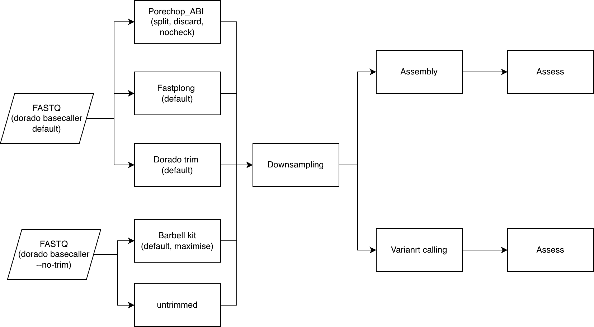
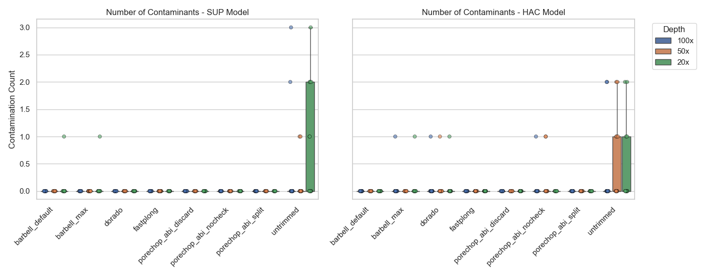
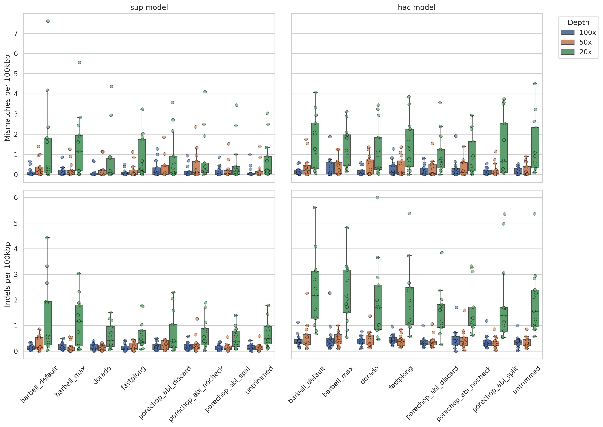
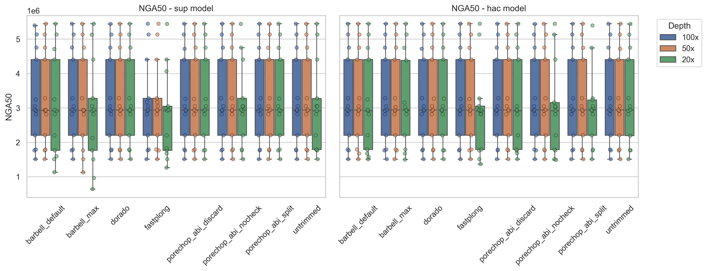
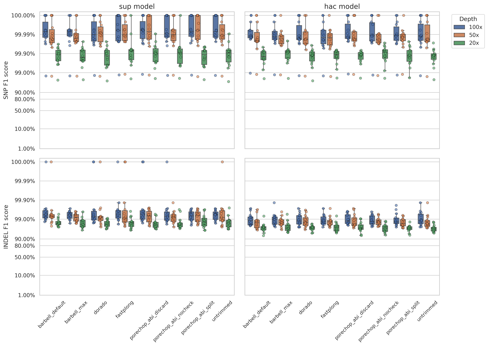

## Overview

## Weekly meeting and action items (13-05-2026)

- I

## Datasets

| Sample                 | Sequencing Kit                 |
|------------------------|--------------------------------|
| ATCC_10708\_\_202309   | SQK-RBK114-96: 825,976 reads   |
| ATCC_17802\_\_202309   | SQK-RBK114-96: 554,861 reads   |
| ATCC_19119\_\_202309   | SQK-RBK114-96: 641,925 reads   |
| ATCC_25922\_\_202309   | SQK-RBK114-96: 1,069,262 reads |
| ATCC_35897\_\_202309   | SQK-RBK114-96: 1,001,157 reads |
| ATCC_BAA-679\_\_202309 | SQK-RBK114-96: 886,871 reads   |
| ATCC_33560\_\_202309   | SQK-NBD114-96: 512,332 reads   |
| ATCC_35221\_\_202309   | SQK-NBD114-96: 411,321 reads   |
| AJ292\_\_202310        | SQK-NBD114-96: 71,694 reads    |
| RDH275\_\_202311       | SQK-NBD114-96: 1,010,169 reads |
| MMC234\_\_202311       | SQK-NBD114-96: 236,014 reads   |
| BPH2947\_\_202310      | SQK-NBD114-96: 162,292 reads   |
| AMtb_1\_\_202402       | SQK-NBD114-96: 186,332 reads   |

Removed the lowest-depth sample, KPC2\_\_202310 (original depth \<100×), leaving 13 samples in the dataset.

## Current pipeline



## Assembly

### Contamination count

```{python}
# import pandas as pd
# import matplotlib.pyplot as plt
# import seaborn as sns

# contamination_count = pd.read_csv("../../results/tables/assess/assembly/metrics/contaminant_summary_count.csv")

# sns.set_theme(style="whitegrid")
# models = ["sup", "hac"]
# hue_order = ["100x", "50x", "20x"]
# order_abs = sorted(contamination_count["trimmer"].unique())

# fig, axes = plt.subplots(nrows=1, ncols=len(models), figsize=(14, 5.5), dpi=100, sharex=True, sharey=True)

# for c, model in enumerate(models):
#     ax = axes[c]
#     # During loop 1, the variable `model` equals "sup"
#     contamination_count_sub = contamination_count.query("model == @model")

#     if not contamination_count_sub.empty:
#         sns.boxplot(data=contamination_count_sub, x="trimmer", y="contamination_count", hue="depth", order=order_abs, hue_order=hue_order, ax=ax, fliersize=0, gap=0.1)

#         sns.stripplot(data=contamination_count_sub, x="trimmer", y="contamination_count", hue="depth", order=order_abs, hue_order=hue_order, ax=ax, alpha=0.6, dodge=True, linewidth=0.5, edgecolor="black", legend=False)

#     # force standard numbers instead of scientific notation
#     ax.yaxis.set_major_formatter(plt.ScalarFormatter())

#     # clean up the labels for a polished look
#     ax.set_ylabel("Contamination Count" if c == 0 else "")
#     ax.set_title(f"Number of Contaminants - {model.upper()} Model")
#     ax.set_xlabel("")
#     ax.set_xticks(ax.get_xticks())
#     ax.set_xticklabels(ax.get_xticklabels(), rotation=45, ha="right", fontsize=11)

#     if c == 1 and ax.get_legend() is not None:
#         ax.legend(title="Depth", bbox_to_anchor=(1.05, 1), loc='upper left')
#     elif ax.get_legend() is not None:
#         ax.get_legend().remove()

# fig.tight_layout()
# plt.savefig("../../results/figures/assess/assembly/metrics/assembly_contamination_minimap2_9may.png")
```



- Now the contamination counts are much lower overall, and the results are more comparable and less extreme than those from last week.
- Every single contig that has barcode/adapter contaminants is non-circular, even in the 100x datasets.
- Vast majority of the residual adapter/barcode are at the start or end of the contigs.
- Few intances are in the middle, does it indicate the chimeric reads?
- From the thee `porechop_abi` runs, only the run with `--no-check` option has the barcode/adapter contaminants in the middle of the contigs.
- `barbell kit` with `maximize` option also has contaminant in the middle (in a 100 depth sample)
- In overall, after untrimmed dataset, `fastplong` is the worst perfoming tool for removing contamination in assemblies. `barbell` and `porechop` handle the barcode/adapter contaminants the best.

### Contamination details

```{python}
import pandas as pd
from itables import show

contamination_details = pd.read_csv("../../results/tables/assess/assembly/metrics/contaminant_details.csv")

contamination_details.reset_index(drop=True, inplace=True)

show(contamination_details, scrollX=True, scrollY="800px")
```

```{python}
# import pandas as pd
# import re
# import os

# COVERAGE_THRESHOLD = 90  # Change this value to adjust the strictness

# contamination_details = pd.read_csv("../../results/tables/assess/assembly/metrics/contaminant_details.csv")

# def extract_all_coverages(row):
#     """
#     Extracts numerical percentages for all regions based on the kit type.
#     """
#     breakdown = str(row['region_breakdown'])
#     kit = str(row['kit'])

#     cov_data = {
#         'adapter_cov': pd.NA,
#         'left_cov': pd.NA,
#         'barcode_cov': pd.NA,
#         'right_cov': pd.NA
#     }

#     if kit == 'rapid':
#         m_left = re.search(r'Left:\s*(\d+)%', breakdown)
#         m_bar = re.search(r'Bar:\s*(\d+)%', breakdown)
#         m_right = re.search(r'Right:\s*(\d+)%', breakdown)

#         if m_left: cov_data['left_cov'] = int(m_left.group(1))
#         if m_bar: cov_data['barcode_cov'] = int(m_bar.group(1))
#         if m_right: cov_data['right_cov'] = int(m_right.group(1))

#     elif 'native' in kit:
#         m_adapter = re.search(r'Adapter:\s*(\d+)%', breakdown)
#         m_bar = re.search(r'Bar\+Flank:\s*(\d+)%', breakdown)

#         if m_adapter: cov_data['adapter_cov'] = int(m_adapter.group(1))
#         if m_bar: cov_data['barcode_cov'] = int(m_bar.group(1))

#     return pd.Series(cov_data)

# # Apply the function and join the new columns
# extracted_cols = contamination_details.apply(extract_all_coverages, axis=1)
# contamination_details = pd.concat([contamination_details, extracted_cols], axis=1)

# # Flag rows using the configurable threshold
# contamination_details['bar_fully_covered'] = contamination_details['barcode_cov'] >= COVERAGE_THRESHOLD
# contamination_details['adapter_fully_covered'] = contamination_details['adapter_cov'] >= COVERAGE_THRESHOLD
# contamination_details['left_fully_covered'] = contamination_details['left_cov'] >= COVERAGE_THRESHOLD
# contamination_details['right_fully_covered'] = contamination_details['right_cov'] >= COVERAGE_THRESHOLD

# # Force all combinations of Trimmer and Kit to appear (even if count is 0)
# all_trimmers = contamination_details['trimmer'].unique()
# all_kits = ['native_left', 'native_right', 'rapid']

# contamination_details['trimmer'] = pd.Categorical(contamination_details['trimmer'], categories=all_trimmers)
# contamination_details['kit'] = pd.Categorical(contamination_details['kit'], categories=all_kits)

# print(f"Calculating summaries per trimmer (Threshold: >={COVERAGE_THRESHOLD}%)...")

# # 'observed=False' is the magic parameter that includes the empty groups
# summary = contamination_details.groupby(['trimmer', 'kit'], observed=False).agg(
#     total_hits=('kit', 'count'),
#     bar_full_count=('bar_fully_covered', 'sum'),
#     adapter_full_count=('adapter_fully_covered', 'sum'),
#     left_full_count=('left_fully_covered', 'sum'),
#     right_full_count=('right_fully_covered', 'sum')
# )

# # Calculate percentages (using fillna(0) to avoid NaN when total_hits is 0)
# summary['%_Bar_Full'] = (summary['bar_full_count'] / summary['total_hits'] * 100).fillna(0).round(2)
# summary['%_Adapter_Full'] = (summary['adapter_full_count'] / summary['total_hits'] * 100).fillna(0).round(2)
# summary['%_Left_Full'] = (summary['left_full_count'] / summary['total_hits'] * 100).fillna(0).round(2)
# summary['%_Right_Full'] = (summary['right_full_count'] / summary['total_hits'] * 100).fillna(0).round(2)

# # Format the final output DataFrame
# final_summary = summary[[
#     'total_hits',
#     '%_Bar_Full',
#     '%_Adapter_Full',
#     '%_Left_Full',
#     '%_Right_Full'
# ]].copy()

# # Fix the total_hits formatting (groupby sometimes converts zero-counts to floats)
# final_summary['total_hits'] = final_summary['total_hits'].astype(int)

# final_summary
```

### Scan barcode/adapter contamination in the reference assemblies

No contaminants detected in the reference assemblies

### Sequence and Structural Accuracy (Average)

```{python}
import pandas as pd
from itables import show

quast_metrics = pd.read_csv("../../results/tables/assess/assembly/metrics/quast_compiled_metrics.csv")
quast_metrics.reset_index(drop=True, inplace=True)

averaged_metrics = quast_metrics.groupby(['trimmer', 'depth', 'model'])[[
    'Mismatches per 100kbp', 
    'Indels per 100kbp', 
    'NGA50', 
    'misassemblies'
]].mean().reset_index()

show(averaged_metrics, scrollX=True, scrollY="800px")
```





- `untrimmed` dataset doesn't seem perform worst still in all the metrics above.
- `fastplong` perform worst in the NGA50. It consistently yields the lowest NGA50, particularly at 20x depth (dropping to \~2.77M) in `sup` dataset, whereas `dorado` seems to perform the best at NGA50.
- For mismatches and indels, `barbell` with and without `maximize` stuggle at low depth.

## Variant calling

### Precision, Recall, and F1 scrore

```{python}
import pandas as pd
from itables import show

average_metrics = pd.read_csv("../../results/tables/assess/call/metrics/trimming_variant_summary_averages.csv")

average_metrics.reset_index(drop=True, inplace=True)

show(average_metrics, scrollX=True, scrollY="800px")
```



```{python}
import pandas as pd
from itables import show

call_assessment = pd.read_csv("../../results/tables/assess/call/metrics/trimming_variant_summary.csv")

grouped_call_assessment = call_assessment.groupby(['trimmer', 'model', 'depth', 'VAR_TYPE'])[['TRUTH_FN', 'QUERY_FP']].sum().reset_index()

asess_table = grouped_call_assessment.rename(columns={
    'TRUTH_FN': 'Total_False_Negatives',
    'QUERY_FP': 'Total_False_Positives'
})

asess_table = asess_table.sort_values(by=['trimmer', 'model', 'depth', 'VAR_TYPE'])

show(asess_table, scrollX=True, scrollY="800px")
```