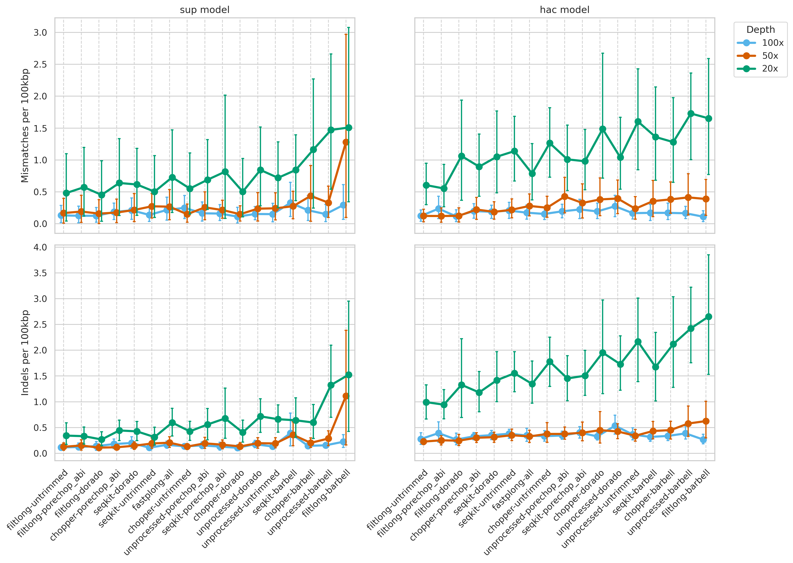
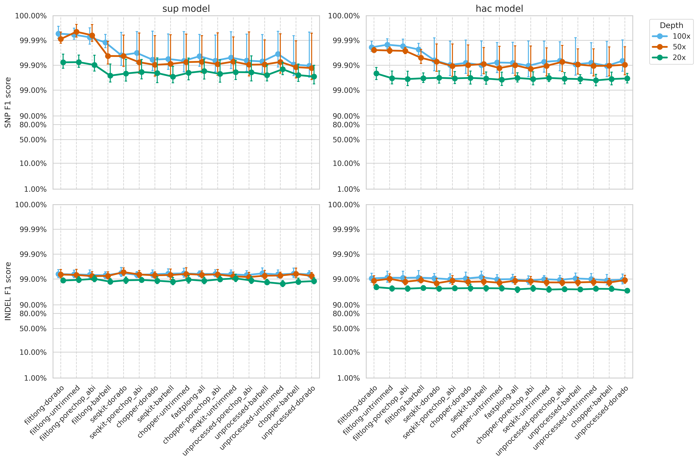
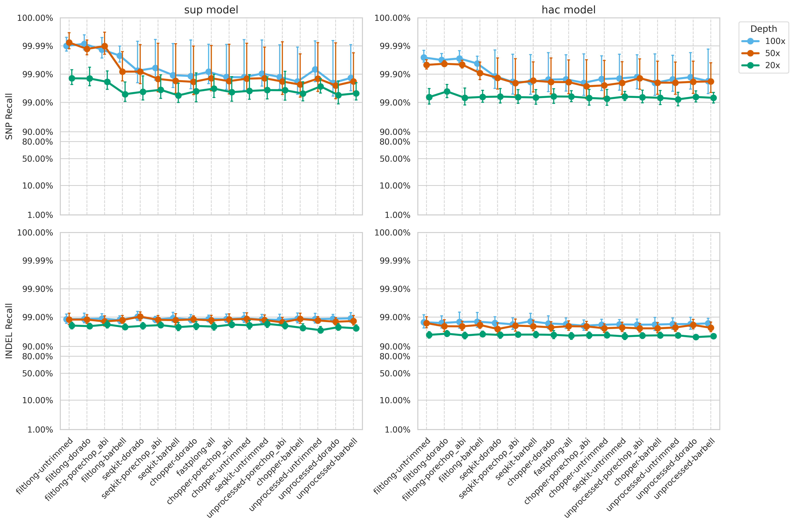

## Overview

Since no QC tool combination consistently performed best across all assembly metrics, we developed an interactive dashboard that alows us to adjust the importance (weight) of each assembly metric based on their priorities.

Additionally, I generated point plots for assembly sequence accuracy metrics (indels and mismatches) and applied a 100 bp minimum read length cutoff across `seqkit`, `chopper`, and `fastplong` preprocessing steps.

## Weekly meeting and action items (10-06-2026)

- Add one more metrics for assembly to infer how QC preprocessing might make us miss small plasmid: unligned contig
- Add this metrics in the weighting formula
- Sum mis contig across the sample, and plot them
- Add also coverage to infer whether this contig completely missed or partially missed
- We might just delete 50x in the assessment, as it doesn't reall differe to 100x.. or it doesn't add any additional information.

## Interactive QC tools weighting

The assembly evaluation metrics from QUAST and assembly contamination analysis were combined and used as input for the interactive dashboard.

The dashboard is available here: [Tool Weighting Dashboard](https://adimascf.github.io/biox7021/tool_weighting.html), This approach was inspired by the weighting strategy used in `filtlong`.

```{python}
import pandas as pd

quast_metrics = pd.read_csv("../../results/tables/assess/assembly-100x-20x/metrics/combo_quast_compiled_metrics.csv")
contam_metrics = pd.read_csv("../../results/tables/assess/assembly-100x-20x/metrics/combo_contaminant_summary_count.csv")
miscontig_metrics = pd.read_csv("../../results/tables/assess/assembly-100x-20x/metrics/combo_assembly_missed_contigs.csv")

assembly_metrics = quast_metrics.merge(
    contam_metrics, on=['combo', 'depth', 'sample', 'model'], how='inner'
).merge(
    miscontig_metrics, on=['combo', 'depth', 'sample', 'model'], how='inner'
)
assembly_metrics.to_csv("../assembly_metrics.csv", index=False)
```

## Sequence accuracy pointplot



## F1 score (100 read length threshold)



## Recall (100 read length threshold)

