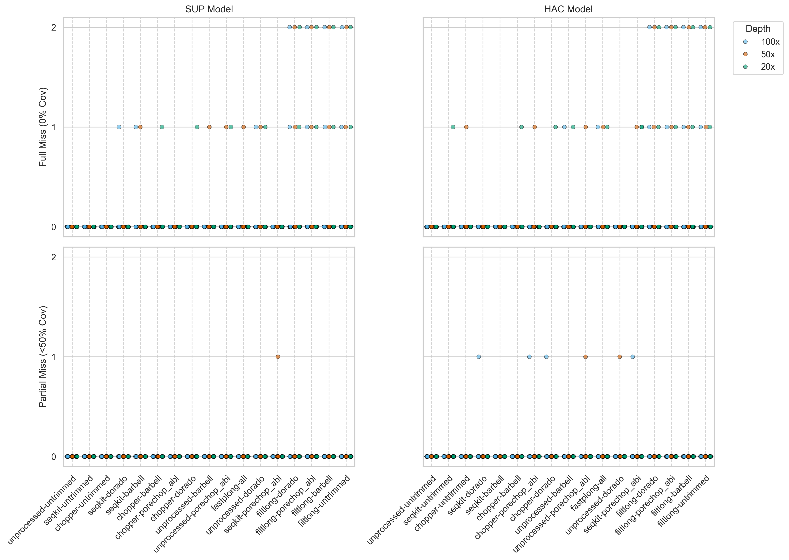
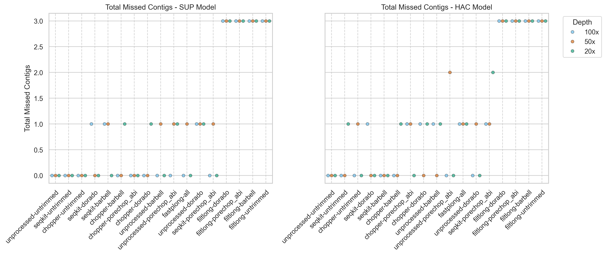

## Overview

I have included a "missed contigs" metric as part of the genome assembly quality assessment. This metric is now also integrated into the weighting formula in the QC tool selection dashboard.

## Weekly meeting and action items (17-06-2026)

- Scoring

## Missed contigs Assessment

### Full vs. partial plasmid Loss

```{python}
import pandas as pd
import numpy as np
import matplotlib.pyplot as plt
from matplotlib.ticker import MaxNLocator
import seaborn as sns
from typing import List

INPUT_CSV = "../../results/tables/assess/assembly-combo-100length/metrics/combo_assembly_missed_contigs.csv"
OUTPUT_FIGURE = "../../results/figures/assess/assembly-combo-100length/metrics/combo_assembly_missed_contigs_no_annot.png"

# Colourblind-friendly palette from colour universal design (CUD)
named_colors = {
    "black": "#000000",
    "orange": "#e69f00",
    "skyblue": "#56b4e9",
    "vermilion": "#d55e00",
    "bluish green": "#009e73",
    "yellow": "#f0e442",
    "blue": "#0072b2",
    "reddish purple": "#cc79a7",
}
cud_palette = list(named_colors.values())

def cud(n: int = len(cud_palette), start: int = 0) -> List[str]:
    remainder = cud_palette[:start]
    palette = cud_palette[start:] + remainder
    return palette[:n]

# Load the already compiled CSV data
print(f"Loading data from {INPUT_CSV}...")
missed_df = pd.read_csv(INPUT_CSV)

# Melt the dataframe for the 2x2 grid (Individual Sample Points)
melted_df = missed_df.melt(
    id_vars=["sample", "combo", "depth", "model"],
    value_vars=["full_missed", "partial_missed"],
    var_name="miss_type",
    value_name="count"
)

sns.set_theme(style="whitegrid")
models = ["sup", "hac"]
hue_order = ["100x", "50x", "20x"]
miss_types = ["full_missed", "partial_missed"]
miss_labels = {"full_missed": "Full Miss (0% Cov)", "partial_missed": "Partial Miss (<50% Cov)"}

# Sort combos by lowest mean total missed contigs (Best to Worst overall)
combo_perf = missed_df.groupby("combo")["total_missed"].mean()
order_abs = combo_perf.sort_values(ascending=True).index.tolist()

fig, axes = plt.subplots(nrows=2, ncols=len(models), figsize=(14, 10), dpi=300, sharex=True, sharey=True)

for r, m_type in enumerate(miss_types):
    for c, model in enumerate(models):
        ax = axes[r, c]
        df_sub = melted_df.query("model == @model and miss_type == @m_type").copy()

        if not df_sub.empty:
            draw_legend = (r == 0 and c == len(models) - 1) 
            sns.stripplot(
                data=df_sub, x="combo", y="count", hue="depth", 
                order=order_abs, hue_order=hue_order,
                palette=cud(len(hue_order), start=2), 
                ax=ax, alpha=0.6, dodge=True, linewidth=0.5, edgecolor="black", legend=draw_legend
            )

        ax.yaxis.set_major_locator(MaxNLocator(integer=True))
        
        if c == 0:
            ax.set_ylabel(miss_labels[m_type])
        else:
            ax.set_ylabel("")

        if r == 0:
            ax.set_title(f"{model.upper()} Model")
        
        ax.set_xlabel("")
        ax.xaxis.grid(True, linestyle='--', color='lightgrey', zorder=0)

        if r == 1:
            ax.set_xticks(range(len(order_abs)))
            ax.set_xticklabels(order_abs, rotation=45, ha="right", rotation_mode="anchor", fontsize=11)
        else:
            ax.tick_params(labelbottom=False)

        if r == 0 and c == len(models) - 1 and ax.get_legend() is not None:
            ax.legend(title="Depth", bbox_to_anchor=(1.05, 1), loc='upper left')

fig.tight_layout()
fig.savefig('../../results/figures/assess/assembly-combo-100length/metrics/combo_assembly_missed_contigs_1.png', bbox_inches='tight')
plt.close(fig)
print(f"Saved original 2x2 plot to ../../results/figures/assess/assembly-combo-100length/metrics/combo_assembly_missed_contigs_1.png")


# Plot 2: 1x2 Grid (Pooled across the samples and missed contig types)
# Calculate the sum of total missed contigs across all samples for each tool combo/depth
pooled_df = missed_df.groupby(["combo", "model", "depth"])["total_missed"].sum().reset_index()

fig2, axes2 = plt.subplots(nrows=1, ncols=len(models), figsize=(14, 6), dpi=300, sharex=True, sharey=True)

# Safety check for single axes
if not isinstance(axes2, (np.ndarray, list)):
    axes2 = [axes2]

for c, model in enumerate(models):
    ax = axes2[c]
    df_sub = pooled_df.query("model == @model").copy()

    if not df_sub.empty:
        # sns.barplot(
        #     data=df_sub, x="combo", y="total_missed", hue="depth", 
        #     order=order_abs, hue_order=hue_order,
        #     palette=cud(len(hue_order), start=2), 
        #     ax=ax, edgecolor="black", linewidth=0.8
        # )

        sns.stripplot(
            data=df_sub, x="combo", y="total_missed", hue="depth", 
            order=order_abs, hue_order=hue_order,
            palette=cud(len(hue_order), start=2), 
            ax=ax, alpha=0.6, dodge=True, linewidth=0.5, edgecolor="black"
        )

    ax.yaxis.set_major_formatter(plt.ScalarFormatter())
    
    if c == 0:
        ax.set_ylabel("Total Missed Contigs")
    else:
        ax.set_ylabel("")

    ax.set_title(f"Total Missed Contigs - {model.upper()} Model")
    ax.set_xlabel("")
    ax.xaxis.grid(True, linestyle='--', color='lightgrey', zorder=0)

    ax.set_xticks(range(len(order_abs)))
    ax.set_xticklabels(order_abs, rotation=45, ha="right", rotation_mode="anchor", fontsize=11)

    # Manage legends
    if c == len(models) - 1 and ax.get_legend() is not None:
        ax.legend(title="Depth", bbox_to_anchor=(1.05, 1), loc='upper left')
    elif ax.get_legend() is not None:
        ax.get_legend().remove()

fig2.tight_layout()
fig2.savefig('../../results/figures/assess/assembly-combo-100length/metrics/combo_assembly_total_missed_contigs_1.png', bbox_inches='tight')
plt.close(fig2)
print(f"Saved pooled totals plot to ../../results/figures/assess/assembly-combo-100length/metrics/combo_assembly_total_missed_contigs_1.png")
```



### Total missed contigs (partial + full)



My observation:

- **Raw reads work best for small plasmids**: Only the raw, completely untrimmed and unprocessed reads successfully assembled every contig across all models and depths.

- **Any preprocessing causes loss**: Every single preprocessing step we tested whether quality filtering or adapter trimming caused small contigs to be partially or fully lost during assembly across the datasets.

- **Adapter trimming alone drops plasmids**: Quality filtering isn't the only one to blame. Just using adapter trimmers (like `dorado`, `porechop_abi`, or `barbell`) on raw reads is enough to completely lose very small sequences, like the 1.9 kb plasmid_4.

- **`filtlong` is the most aggressive**: preprocessing using `filtlong` drop the most contigs. It consistently removes plasmids under 3.2 kb entirely, specifically missing plasmid_3 (3.1 kb) and plasmid_4 (1.9 kb) in ATCC_25922, and plasmid_2 (3.0 kb) in BPH2947.

### Missed contigs details

```{python}
import pandas as pd
from itables import show

miscontig_metrics = pd.read_csv("../../results/tables/assess/assembly-combo-100length/metrics/combo_assembly_missed_contigs.csv")

hac_only = miscontig_metrics[miscontig_metrics['model'] == 'hac']
sup_only = miscontig_metrics[miscontig_metrics['model'] == 'sup']

hac_only.reset_index(drop=True, inplace=True)
show(hac_only, scrollX=True, scrollY="800px")
```

```{python}
sup_only.reset_index(drop=True, inplace=True)
show(sup_only, scrollX=True, scrollY="800px")
```