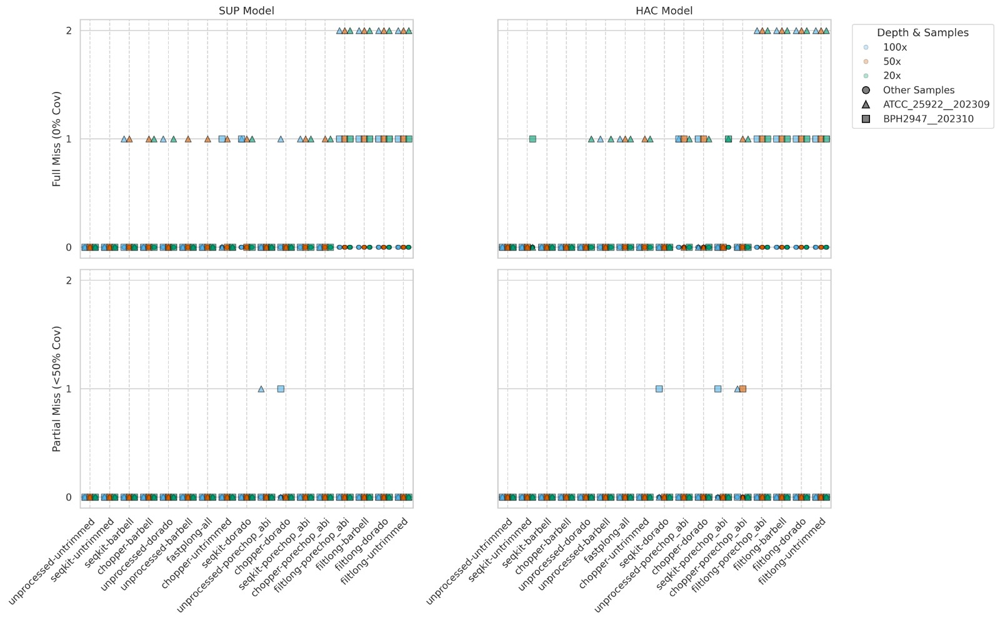
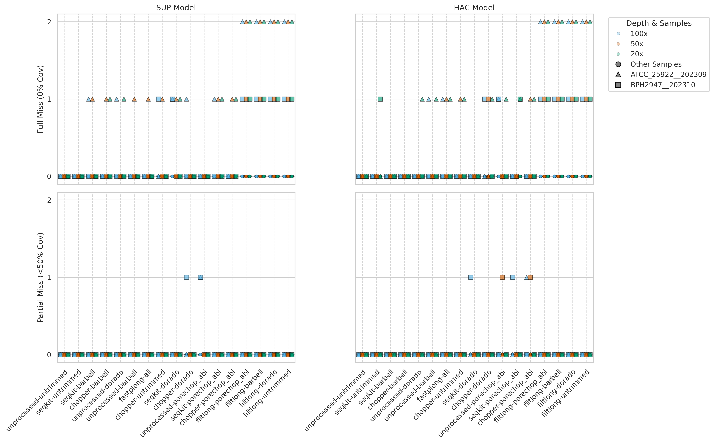
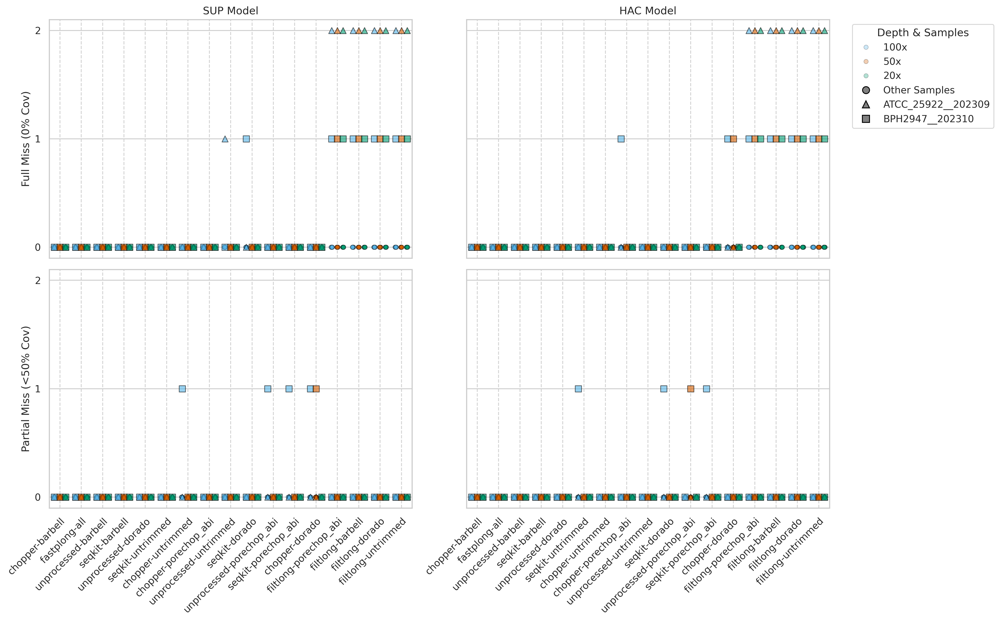
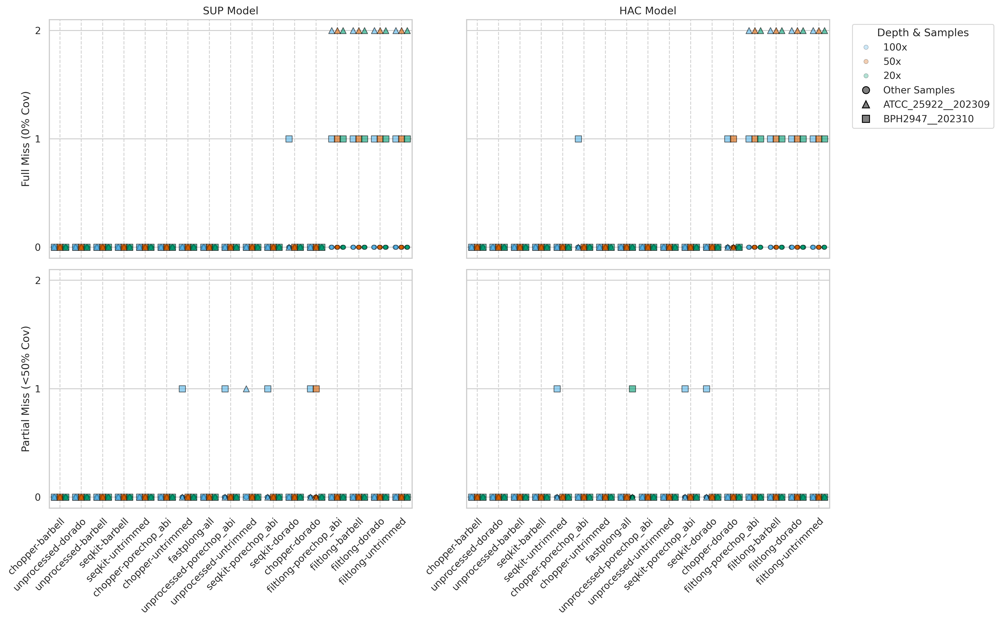
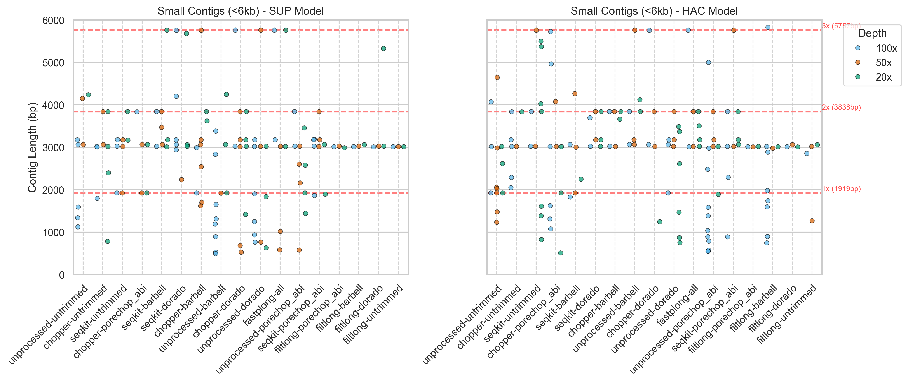
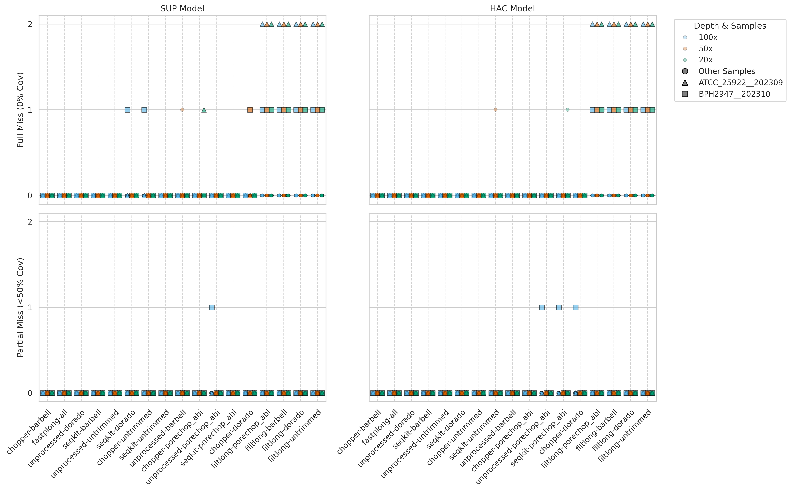

## Overview

- **Investigated Flye’s Minimum Overlap:** Tested the datasets using `minOverlap` 1500 and 1000
- **Used Debug Logging:** Included the `--debug` flag in the Flye assembly step
- **Calculated Survey Weightings:** Using the arithmetic mean
- **Documented Thesis Findings:** Described the small plasmid recovery issue (specifically, how high depths often miss plasmids that lower depths recover) and explained the plausible causes.

## Weekly meeting and action items (22-07-2026)

-

## Detour: Flye's non-deterministic behaviour

I think I made a mistake when I previously said that the small plasmid recovery issue was not caused by Flye's non-deterministic behaviour. At the time, I had only manually tested Flye's non-determinism on two datasets. However, after rerunning my Snakemake pipeline starting from the assembly step, I got different results (as shown in the missed contigs figure) between runs. Look at the `unprocessed-porechop_abi` and `chopper-dorado` SUP facet on two figures below.

This non-deterministic behaviour occurs during Flye's multithreading step in the disjointig generation stage, where the output can vary slightly depending on how threads are scheduled by the operating system (Flye issue [#509](https://github.com/mikolmogorov/Flye/issues/509)).

I set `seed == 1` in downsampling step, but concerned about whether the QC tools, variant caller, and assembler I used in my Snakemake pipeline are fully deterministic, or always give identical result between runs.






## My attempts to investigate small plasmids discrepancy between downsampling depths

### Lowering the minimum overlap value

#### Minimum overlap 1000

By decreasing value for minimum overlap (1000), we can recover more small plasmids across different combination of tools, downsampling depths, and basecalling models. But it is in the cost of recovering more suporious small contigs noise as well.







#### Minimum overlap 1500




### Investigating the Role of Concatemer Reads in Small Plasmid Assembly

If we remove concatemer reads from the dataset, then flye is not able to assemble the plasmid_4 (1919bp). I tried this in two dataset `unprocessed-untrimmed` 100x SUP and `chopper-untrimmed `100x SUP and `unporcessed-barbell` 20x SUP. Flye could not assemblye the plasmid_4 in these dataset previously with `chopper-untrimmed` is partially assembled the plasmid_4 (31.6%).

#### Identifying Concatemer Read IDs

To determine if concatemer reads are driving the successful assembly of small plasmids, the first step was to identify the read IDs of potential dimers/trimers. Raw reads were mapped to the assembled plasmid sequence, and awk was used to filter for reads with alignment lengths greater than 2001 bp (exceeding the 1919 bp monomer length).

```{python}
#| eval: false
# Map raw untrimmed reads to the assembled plasmid_4 sequence and extract read IDs for concatemers (>2001 bp alignment)
minimap2 --secondary=no unprocessed-untrimmed_ATCC_25922__202309_plasmid_4.fa \
  /scratch/project/bug_seq_scratch/qc_bench/results/QC/downsampling/unprocessed-untrimmed/100x/sup/ATCC_25922__202309.unprocessed-untrimmed.rasusa.fastq | \
  awk '($9 - $8) > 2001 { print $1}' > ATCC_25922__202309.unprocessed-untrimmed.dimer_reads.id
```

#### Comparing Concatemer Integrity Before and After Adapter Trimming

```{python}
#| eval: false
# Extract concatemer reads from the untrimmed dataset
seqkit grep -f ATCC_25922__202309.unprocessed-untrimmed.dimer_reads.id \
  data/fastqs/trim/sup/ATCC_25922__202309.fastq > missed_plasmid_investigation/untrimmed_concatemers.fastq

# Extract the same concatemer reads from the Dorado-trimmed dataset
seqkit grep -f ATCC_25922__202309.unprocessed-untrimmed.dimer_reads.id \
  /scratch/project/bug_seq_scratch/qc_bench/results/QC/downsampling/unprocessed-dorado/100x/sup/ATCC_25922__202309.unprocessed-dorado.rasusa.fastq > missed_plasmid_investigation/dorado_concatemers.fastq

seqkit fx2tab -l -n -i missed_plasmid_investigation/untrimmed_concatemers.fastq | sort > missed_plasmid_investigation/untrimmed_lengths.txt
seqkit fx2tab -l -n -i missed_plasmid_investigation/dorado_concatemers.fastq | sort > missed_plasmid_investigation/dorado_lengths.txt

join -1 1 -2 1 missed_plasmid_investigation/untrimmed_lengths.txt missed_plasmid_investigation/dorado_lengths.txt | \
  awk '{print $1, "\t", $2, "\t", $3, "\t", $2-$3}' > missed_plasmid_investigation/concatemer_length_comparison.tsv
```

#### Experimental Depletion of Concatemers

```{python}
#| eval: false
# Remove concatemer reads from the seqkit-untrimmed and chopper-untrimmed datasets
seqkit grep -f ATCC_25922__202309.unprocessed-untrimmed.dimer_reads.id -v \
  /scratch/project/bug_seq_scratch/qc_bench/results/QC/downsampling/seqkit-untrimmed/100x/sup/ATCC_25922__202309.seqkit-untrimmed.rasusa.fastq \
  -o ATCC_25922__202309.seqkit-untrimmed.nodimer.fastq

seqkit grep -f ATCC_25922__202309.unprocessed-untrimmed.dimer_reads.id -v \
  /scratch/project/bug_seq_scratch/qc_bench/results/QC/downsampling/chopper-untrimmed/100x/sup/ATCC_25922__202309.chopper-untrimmed.rasusa.fastq \
  -o ATCC_25922__202309.chopper-untrimmed.nodimer.fastq

ssubmit -m 16g -t 6h flye "flye --debug --nano-hq ATCC_25922__202309.chopper-untrimmed.nodimer.fastq --out-dir flye_chopper-untrimmed_nodimer --threads 8" -- -c 8
```

## Community survey

Because every respondent in the survey gave 100 points across the four parameters.I think we can use arithmetic mean:

```{python}
import pandas as pd

df = pd.read_csv("../../microbial-qc-survey.csv")

weight_cols = ['w_accuracy', 'w_contiguity', 'w_decontam', 'w_replicon']

# Calculate the arithmetic mean for each column
mean_weights = df[weight_cols].mean()

# Build a new summary DataFrame to visualize the results
summary_df = pd.DataFrame({
    'Survey Parameter': weight_cols,
    'Mean': mean_weights.values,
    'Mean (rounded)': (mean_weights.values / 100).round(2)
})
print(summary_df.to_string(index=False))
```


## Paragraph to explain why the issue occured

During the assembly assessment of missed contigs, all QC combinations, except for the unprocessed and untrimmed raw data, missed at least one of the two small plasmids (ATCC_25922__202309 at 1919 bp and BPH2947__202310 at 3011 bp) across the different downsampling depths and basecalling models. All Filtlong combinations completely missed these small plasmids across all depths and models because its quality preprocessing mechanism prioritises longer reads, it effectively filters out the short reads associated with these small plasmids. The other QC combinations retained the short plasmid reads, but their resulting assemblies still occasionally missed the small plasmids (mostly the 1919 bp ATCC_25922__202309) across different depths and models.

In the context of small plasmids, adapter trimming appears to have a detrimental effect. Excluding the Filtlong combinations, seqkit-untrimmed and barbell-untrimmed only missed small plasmids once each: in the HAC 20x dataset (BPH2947__202310) and the HAC 50x dataset (ATCC_25922__202309), respectively. However, any combinations where adapter trimming was performed missed the small plasmids two or more times across the different depths and basecalling models.

The BPH2947__202310 small plasmid was only missed in the HAC datasets. Furthermore, there is no pattern suggesting that low-depth samples miss small contigs more frequently. Instead, several tool combinations successfully recovered small plasmids at lower depths but failed to do so at higher depths. For instance, the seqkit-barbell combination under the SUP model recovered the 1919 bp plasmid at 20x depth but missed it at 50x and 100x, while seqkit-dorado recovered it at 20x and 50x but missed it at 100x. This "high depth misses, low depth recovers" phenomenon was exclusive to plasmid_4 (1919 bp) from the ATCC_25922__202309 sample. At the assembly level, reruns revealed that Flye exhibits non-deterministic behavior when recovering this 1919 bp plasmid. This randomness is caused by the multithreading process during the disjointig generation step, making the plasmid's recovery highly sensitive to minor assembler heuristic fluctuations.

Analysis of Flye's underlying algorithm, dataset metrics, and subsequent read-filtering tests indicates this failure is driven by a combination of overlap thresholds, extreme coverage spikes, and a reliance on concatemer reads that are susceptible to unintended adapter trimming processing. Flye uses a dynamic `minOverlap` parameter based on the read length N90 to stitch reads together and collapse repetitive sequences in the repeat graph. This inherently causes it to struggle with small plasmids that fall below this dynamic length limit. Additionally, at 50x and 100x overall sample depth, the localised coverage of these high-copy small plasmids spikes to extreme levels—around 10,000x—which Flye likely treats as sequencing noise and discards [ref](https://www.microbiologyresearch.org/content/journal/mgen/10.1099/mgen.0.001024#F3).

Crucially, the successful assembly of these small plasmids seems to rely on the presence of concatemer reads. Concatemer forms are frequently observed in the assembly results across different tool combinations, depths, and models. For example, the SUP unprocessed-untrimmed 100x dataset produced a dimer (3838 bp), and the SUP seqkit-untrimmed 100x dataset formed a trimer (5757 bp). Mapping the raw reads to these concatemer plasmid sequences indicates that they are native to the raw read dataset rather than artifacts introduced during assembly. Because these concatemer reads are significantly longer than a single plasmid unit, they satisfy Flye's high `minOverlap` requirements, allowing the assembler to successfully create disjointigs.

This concatemer dependency was proven by experimentally removing concatemer reads from the datasets (tested on unprocessed-untrimmed 100x, chopper-untrimmed 100x, and unprocessed-barbell 20x SUP). Without these concatemers, Flye completely failed to assemble the 1919 bp plasmid. Consequently, this explains the negative impact of the trimming steps: adapter trimming tools likely mutate or over-trim the ends of these critical concatemer reads, destroying the overlap sequence required for the assembler to resolve the disjointig. While manually decreasing the `minOverlap` parameter (e.g., to 1000 or 1500) forces Flye to stitch shorter reads and successfully rescues more small plasmids across different QC combinations, contig length distributions reveal that this comes at the significant cost of introducing a high volume of spurious small contig noise.

Another plausible explanation is that read filtering and adapter trimming fundamentally alter the dataset's characteristics—such as the median overlap divergence—which Flye relies on during the disjointig process. The three downsampling depths also influence these algorithmic thresholds, leading to highly variable small plasmid recovery rates across different trimming tools and depths. Ultimately, having a higher sequencing depth does not guarantee successful small plasmid recovery, just as having a lower depth does not necessarily mean it will be missed.


