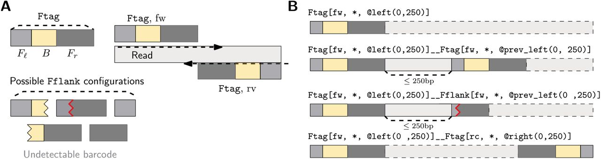

## Overview

------------------------------------------------------------------------

## Weekly meeting and action items (25-04-2026)

- Include `fitlong` for quality filtering in the benchmarking
- Strip away the demultiplexing tools, focus on QC step
- Just used dorado for demultiplexing step
- QC step is including:
  - Adapter trimming (fastplong, barbell, porechop/ABI)
  - Quality trimming (fastplong, chopper?, fitlong)
  - and also quality filtering (fastp, fitlong)
- Dimas download raw signal (pod5 files) from Michael's variant caller benchmark paper
- Run basecalling using `sup` accuracy and `simplex` mode
- Need to start thinking about outline for my project plan

[fitlong](https://github.com/rrwick/Filtlong) is a quality based long read filtering that select a subset of high quality reads based on weighted score of length and sequence identity. Rank reads either using phred score or kmer matches against reference sequence.

```{python}
import itertools

demultiplexer = ["dorado",]
trimming_tools = ["porechop/ABI", "fastplong", "barbell", "dorado", "none"]
filtering_tools = ["fastplong", "fitlong", "none"]
applications = ["Assembly", "Variant calling", "Taxonomic assignment"]

# all possible combinations
pipelines = list(itertools.product(demultiplexer, trimming_tools, filtering_tools, applications))

for i, (demux, trim, filt, app) in enumerate(pipelines, start=1):
    print(f"Run {i:02}: {demux} -> {trim} -> {filt} -> {app}")

print(f"\nTotal pipeline to be benchmarked (single dataset): {len(pipelines)}")
```

questions:

- Include barbell in the benchmark as demultiplexing option?

  If so, I think interesting to see if we find that: If dorado indeed has some issue (as mentioned in barbell paper), are standard QC sufficient to mitigate them? If barbell already clear up any QC issue in our dataset, does QC step not really matter anymore? or still matter QC step does not matter regardless our choice of demultiplexing tool, or QC step does matter

- or include barbell in QC step, but it requires "manual" intervention?

- is 24 total pipelines manageable?

- And about our main aims:

  - Do we ask whether necessery or no to perform QC step given downstream analysis? (so we just run dorado with default settings with trim turn on) or
  - Do we ask whther or no adapter/barcode sequences impact downstram analysis? (so we left the adapater/barcode sequences, `--no-trim`) or
  - what kind of QC steps (With paramters) best for a given downstream analysis?

Play around with barbel on our dataset

basecall using dorado each of our sample:

```{{bash}}
ssubmit -t 1d -m 16g basecall "dorado basecaller --no-trim --recursive sup $run_dir > basecalls.bam" -- --qos gpu -p gpu_cuda --gres=gpu:h100:1
```

Scan for barcode masked tags over the reads, extract the barcode region, and assign a label for each barcode using subsequence matches

```{{bash}}
barbell annotate --kit SQK-NBD114-96 -i input.fastq.gz -t 10 -o fastq_anno.tsv
```

Then to trim, we need to specify wwhat kind of patterns in our dataset, we want to filter and trim the tags (filters.txt):

```{{bash}}
Ftag[fw, *, @left(0..250), >>]__Ftag[<<. rc, *, @right(0..250)]
Ftag[fw, *, @left(0..250), >>]
Ftag[<<. rc, *, @right(0..250)]
```

{fig-align="center" width="80%"}

Example result for MMC234\_\_202311 (probably from single run):

```{{bash}}
-rw-r--r-- 1 s4897040 qris-uq  85K Mar  8 16:19 NB14_fw.trimmed.fastq
-rw-r--r-- 1 s4897040 qris-uq  93K Mar  8 16:19 NB11_fw.trimmed.fastq
-rw-r--r-- 1 s4897040 qris-uq  19K Mar  8 16:19 NB13_fw.trimmed.fastq
-rw-r--r-- 1 s4897040 qris-uq 101K Mar  8 16:19 NB12_fw.trimmed.fastq
-rw-r--r-- 1 s4897040 qris-uq 1.7G Mar  8 16:19 NB10_fw.trimmed.fastq
-rw-r--r-- 1 s4897040 qris-uq  77K Mar  8 16:19 NB08_fw.trimmed.fastq
-rw-r--r-- 1 s4897040 qris-uq 127K Mar  8 16:19 NB09_fw.trimmed.fastq
```

for ATCC_35221\_\_202309 (come from multiple runs):

```{{bash}}
-rw-r----- 1 s4897040 qris-uq 2.7M Mar 11 05:13 NB83_fw.trimmed.fastq
-rw-r----- 1 s4897040 qris-uq 1.4M Mar 11 05:13 NB80_fw.trimmed.fastq
-rw-r----- 1 s4897040 qris-uq 2.4K Mar 11 05:13 NB11_fw.trimmed.fastq
-rw-r----- 1 s4897040 qris-uq 4.9K Mar 11 05:13 NB59_fw.trimmed.fastq
-rw-r----- 1 s4897040 qris-uq 192K Mar 11 05:13 NB71_fw.trimmed.fastq
-rw-r----- 1 s4897040 qris-uq 1.4M Mar 11 05:13 NB78_fw.trimmed.fastq
-rw-r----- 1 s4897040 qris-uq 192K Mar 11 05:13 NB72_fw.trimmed.fastq
-rw-r----- 1 s4897040 qris-uq 4.5M Mar 11 05:13 NB86_fw.trimmed.fastq
-rw-r----- 1 s4897040 qris-uq 1.4M Mar 11 05:13 NB79_fw.trimmed.fastq
-rw-r----- 1 s4897040 qris-uq 7.7K Mar 11 05:13 NB94_fw.trimmed.fastq
-rw-r----- 1 s4897040 qris-uq  11M Mar 11 05:13 NB73_fw.trimmed.fastq
-rw-r----- 1 s4897040 qris-uq 130K Mar 11 05:13 NB70_fw.trimmed.fastq
-rw-r----- 1 s4897040 qris-uq 2.7M Mar 11 05:13 NB82_fw.trimmed.fastq
-rw-r----- 1 s4897040 qris-uq 1.3K Mar 11 05:13 NB58_fw.trimmed.fastq
-rw-r----- 1 s4897040 qris-uq 3.0M Mar 11 05:13 NB65_fw.trimmed.fastq
-rw-r----- 1 s4897040 qris-uq  68K Mar 11 05:13 NB69_fw.trimmed.fastq
-rw-r----- 1 s4897040 qris-uq 1.3M Mar 11 05:13 NB74_fw.trimmed.fastq
-rw-r----- 1 s4897040 qris-uq  17M Mar 11 05:13 NB81_fw.trimmed.fastq
-rw-r----- 1 s4897040 qris-uq 3.7K Mar 11 05:13 NB45_fw.trimmed.fastq
-rw-r----- 1 s4897040 qris-uq 1.3G Mar 11 05:13 NB76_fw.trimmed.fastq
-rw-r----- 1 s4897040 qris-uq  49M Mar 11 05:13 NB68_fw.trimmed.fastq
-rw-r----- 1 s4897040 qris-uq 3.9M Mar 11 05:13 NB89_fw.trimmed.fastq
-rw-r----- 1 s4897040 qris-uq 804K Mar 11 05:13 NB77_fw.trimmed.fastq
-rw-r----- 1 s4897040 qris-uq 3.7M Mar 11 05:13 NB87_fw.trimmed.fastq
-rw-r----- 1 s4897040 qris-uq 3.0M Mar 11 05:13 NB88_fw.trimmed.fastq
-rw-r----- 1 s4897040 qris-uq 1.3G Mar 11 05:13 NB84_fw.trimmed.fastq
-rw-r----- 1 s4897040 qris-uq 3.4M Mar 11 05:13 NB85_fw.trimmed.fastq
-rw-r----- 1 s4897040 qris-uq  11M Mar 11 05:13 NB75_fw.trimmed.fastq
-rw-r----- 1 s4897040 qris-uq 7.4M Mar 11 05:13 NB90_fw.trimmed.fastq
-rw-r----- 1 s4897040 qris-uq 1.4M Mar 11 05:13 NB67_fw.trimmed.fastq
-rw-r----- 1 s4897040 qris-uq 106K Mar 11 05:13 NB66_fw.trimmed.fastq
```

| Sample | NB01 | NB02 | NB04 | NB05 | NB06 | NB07 | NB08 | NB10 | NB11 | NB12 | NB14 | Dropped |
|------|------|------|------|------|------|------|------|------|------|------|------|------|
| ATCC_10708\_\_202309 |  |  |  |  |  |  |  |  |  |  |  |  |
| ATCC_17802\_\_202309 |  |  |  |  |  |  |  |  |  |  |  |  |
| ATCC_25922\_\_202309 |  |  |  |  |  |  |  |  |  |  |  |  |
| ATCC_33560\_\_202309 |  |  |  |  |  |  |  |  |  |  |  |  |
| ATCC_35221\_\_202309 |  |  |  |  |  |  |  |  |  |  |  |  |
| ATCC_19119\_\_202309 |  |  |  |  |  |  |  |  |  |  |  |  |
| ATCC_35897\_\_202309 |  |  |  |  |  |  |  |  |  |  |  |  |
| ATCC_BAA-679\_\_202309 |  |  |  |  |  |  |  |  |  |  |  |  |
| BPH2947\_\_202310 |  |  |  |  |  |  |  |  |  |  |  |  |
| AJ292\_\_202310 |  |  |  |  |  |  |  |  |  |  |  |  |
| KPC2\_\_202310 |  |  |  |  |  |  |  |  |  |  |  |  |
| RDH275\_\_202311 | 137 | 24 | 196 | 34 | 914928 | 32 |  |  |  |  |  |  |
| MMC234\_\_202311 |  |  |  |  |  |  | 17 | 214957 | 47 | 60 | 17 |  |
| AMtb_1\_\_202402 |  |  |  |  |  |  |  |  |  |  |  |  |
|  |  |  |  |  |  |  |  |  |  |  |  |  |