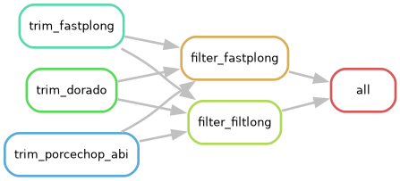

## Overview

------------------------------------------------------------------------

## Weekly meeting and action items (11-03-2026)

- We will be using Snakemake as worklfow management system
- Dimas will go through the documentation and tutorials of snakemake
- Use `dorado` as our solely demultiplexer (with option `–-no-trim`), and we put barbell in the QC step as read trimming tool
- include `porcechop_ABI` in the QC option
- Dimas created shareable project plan draft on overleaf, draft needs to be ready on 21 April
- Week 3 Checkpoint Submission due on 16 March

Current rulegraph:

